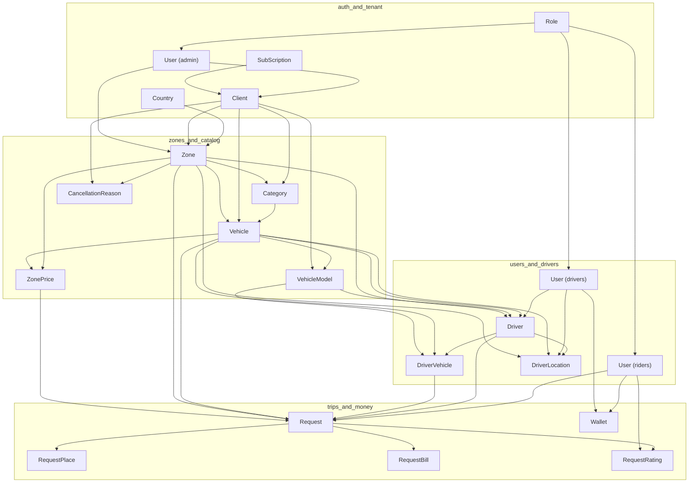

# Load Test Data Generation Strategy

This document describes the **model-by-model data counts** and **order of processing** for generating realistic dummy data for load testing the Uber-clone backend. It is designed so you can run the seeder without changing any existing business logic or schemas.

---

## 1. Processing Order and Counts (What Runs When)

Data **must** be inserted in dependency order. Below is the exact sequence and how many documents per model (full-scale and free-tier–friendly).

| Step | Model | Full-scale count | Free-tier count | Depends on |
|------|--------|-------------------|------------------|------------|
| 1 | **Role** | 3 | 3 | — |
| 2 | **Country** | 5 | 5 | — |
| 3 | **SubScription** | 1 | 1 | — |
| 4 | **User** (admin) | 1 | 1 | Role |
| 5 | **Client** | 1 | 1 | User, SubScription |
| 6 | **Zone** | 3 | 2 | Country, Client, User |
| 7 | **Category** | 3 | 2 | Client, Zone |
| 8 | **Vehicle** | 10,000 | 10 | Category, Client, Zone |
| 9 | **VehicleModel** | 500 | 20 | Vehicle, Client |
| 10 | **CancellationReason** | 5 | 3 | Zone, Client |
| 11 | **ZonePrice** | 30 | 6 | Zone, Vehicle |
| 12 | **User** (riders + drivers) | 60,000 | 1,000 | Role, Country |
| 13 | **Driver** | 10,000 | 200 | User, Vehicle, VehicleModel, Zone |
| 14 | **DriverVehicle** | 10,000 | 200 | Driver, Vehicle, VehicleModel |
| 15 | **Request** | 80,000 | 2,000 | User, Driver, DriverVehicle, Vehicle, Zone, ZonePrice |
| 16 | **RequestPlace** | 80,000 | 2,000 | Request |
| 17 | **RequestBill** | 70,000 | 1,500 | Request (completed only) |
| 18 | **RequestRating** | 70,000 | 1,500 | User, Request |
| 19 | **Wallet** | 60,000 | 1,000 | User |
| 20 | **DriverLocation** | 10,000 | 200 | Driver, User, Vehicle, Zone |

**Rider vs driver split (User):**

- Full: **50,000 riders** + **10,000 drivers** = 60,000 `User` (riders have no `Driver` record).
- Free: e.g. **800 riders** + **200 drivers** = 1,000 `User`.

**Request status split:**

- Full: **70,000 completed**, **10,000 cancelled** (80,000 total).
- Free: **1,500 completed**, **500 cancelled** (2,000 total).

---

## 2. Unique Fields to Avoid Duplicates

| Model | Unique field(s) | How generated |
|-------|-----------------|----------------|
| User | `phoneNumber`, `email` (sparse) | `+1XXXXXXXXXX` and `user_{i}@loadtest.local` |
| Request | `requestNumber` | `TAXI_` + zero-padded sequence |
| DriverVehicle | `licensePlateNumber` | `PLATE-` + unique suffix per driver |
| Driver | `carNumber` (optional) | Same as license or unique per driver |

No changes are made to schema definitions; the seeder only generates values that satisfy existing unique/sparse constraints.

---

## 3. Relationships Summary

- **User** (riders): referenced by `Request.userId`, `RequestRating.userId`, `Wallet.userId`, `WalletTransaction.userId`.
- **User** (drivers): referenced by `Driver.userId`, `DriverLocation.userId`; driver’s `User` is the same collection.
- **Driver**: referenced by `Request.driverId`, `DriverVehicle.driverId`, `DriverLocation.driverId` (and `RequestMeta.driverId` if you seed that).
- **Request**: referenced by `RequestPlace.requestId`, `RequestBill.requestId`, `RequestRating.requestId`, `RequestMeta.requestId`, `WalletTransaction.requestId`.
- **Vehicle**: referenced by `Request.vehicleId`, `Driver.type` / `DriverVehicle.vehicleId`, `DriverLocation.vehicleId`, `ZonePrice.vehicleId`.
- **Zone**: referenced by `Request.zoneId`, `Driver.serviceLocation`, `Category.zoneId`, `Vehicle.zoneId`, `DriverLocation.zoneId`, `ZonePrice.zoneId`, etc.

Referential integrity is maintained by generating IDs in the order above and reusing the same IDs (e.g. completed `Request` _ids used in `RequestBill` and `RequestRating`).

---

## 4. Data Relationships Diagram



---

## 5. Example Generated Documents

**User (rider)**  
- `firstName`, `lastName`, `phoneNumber` (unique), `email` (unique, e.g. `user_1@loadtest.local`), `password` (hashed), `roleIds` → Role, `active: true`, optional `countryCode` → Country, `clientId` → Client, `zoneId` → Zone.

**Driver**  
- `userId` → User (driver), `type` → Vehicle, `carModel` → VehicleModel, `serviceLocation` → Zone, `carNumber`, `isApprove: true`, `status: true`, `clientId` → Client.

**Request (completed)**  
- `requestNumber`: `TAXI_00001`, `userId` → User (rider), `driverId` → Driver, `driverVehicleId` → DriverVehicle, `vehicleId` → Vehicle, `zoneId` → Zone, `zoneTypeId` → ZonePrice, `paymentOpt`: `CARD`|`CASH`|`WALLET`, `rideType`: `RIDE_NOW`, `isCompleted: true`, `totalDistance`, `totalTime`, `tripStartTime`, `completedAt`, etc.

**RequestPlace**  
- `requestId` → Request, `pickLat`, `pickLng`, `dropLat`, `dropLng` (valid coordinates inside zone), `pickAddress`, `dropAddress`.

**RequestBill**  
- `requestId` → Request (completed), `baseDistance`, `totalDistance`, `totalTime`, `totalAmount`, `basePrice`, `distancePrice`, `timePrice`, etc.

**RequestRating**  
- `userId` → User (rider), `requestId` → Request (completed), `rating` 1–5, optional `feedback`.

**Wallet**  
- `userId` → User, `balance`, `earnedAmount`, `amountSpent`, `clientId` → Client.

**DriverLocation**  
- `driverId` → Driver, `userId` → User (driver), `vehicleId` → Vehicle, `zoneId` → Zone, `latitude`, `longitude`, `location` (GeoJSON Point), `isOnline`, `isAvailable`, `lastUpdated`.

---

## 6. Geolocation

- All `pickLat`/`pickLng` and `dropLat`/`dropLng` are valid numbers within a configurable bounding box (e.g. city area).
- `DriverLocation` uses the same coordinate range and a GeoJSON `Point` for `location` (required for 2dsphere index).
- No schema or index definitions are changed; only values are generated to match existing geo fields.

---

## 7. How to Run the Seeder

Run from the **backend** directory (where `package.json` and `seeders/` live).

- **Full-scale** (default):  
  `npm run seed:loadtest`  
  or  
  `node seeders/loadTestData.seeder.js`

- **Free-tier / reduced** (smaller counts to stay within free cluster size):  
  `npm run seed:loadtest:reduce`  
  or  
  `REDUCE=1 node seeders/loadTestData.seeder.js`  
  or set in `.env`: `LOAD_TEST_REDUCE=1`.

- **MongoDB URL** must be set in `.env` as `MONGODB_URL`. The script uses the same connection pattern as existing seeders (e.g. `role.js`, `language.js`).

### Use existing Client, Countries, and Admin User

If you already have a Client, Countries, and an admin User, set these in `.env`:

```env
USE_EXISTING_DATA=1
EXISTING_CLIENT_ID=66d477418c8e995c9073c512
EXISTING_COUNTRY_IDS=66d5848ce928e7a8d374d800,66d5848ce928e7a8d374d86a,66d5848ce928e7a8d374d861,66d5848ce928e7a8d374d85b,66d5848ce928e7a8d374d7f9
EXISTING_ADMIN_USER_ID=677cc1436a665cc47d1123f6
```

Then run `npm run seed:loadtest` or `npm run seed:loadtest:reduce`. The seeder will skip creating Client, Countries, SubScription, and Admin User, and will use your existing records instead.

The seeder uses **batched `insertMany`** and **async parallel where there are no cross-batch dependencies**, so it does not block the event loop for the whole run and avoids inserting “millions in one shot” that could crash the server. Batch size and concurrency are tuned to keep memory and connection usage reasonable (see script comments).

---

## 8. Goal

This setup prepares the database for **high load performance testing** (e.g. 10k+ concurrent requests) with realistic volumes and referential integrity, **without modifying any existing API or schema**.
